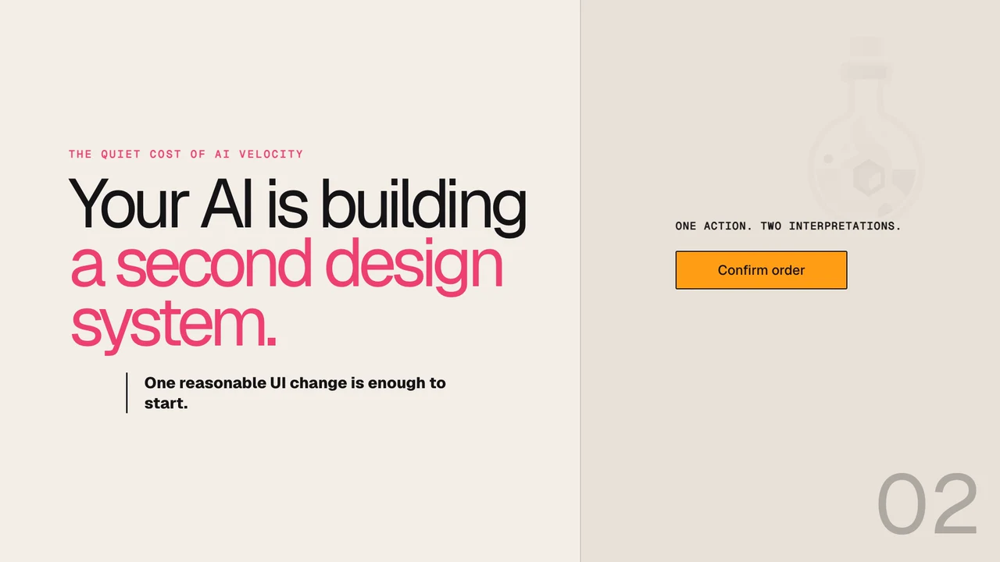

<p align="center">
  <a href="https://decantr.ai">
    
  </a>
</p>

<h1 align="center">Help AI build like it belongs here.</h1>

<p align="center">
  Agent-neutral UI change control for codebases edited by AI.
</p>

<p align="center">
  <a href="https://decantr.ai">Website</a> ·
  <a href="./docs/guides/existing-apps.md">Get started</a> ·
  <a href="./docs/reference/change-assurance.md">Documentation</a> ·
  <a href="https://discord.gg/NPbXFyqY6">Discord</a>
</p>

<p align="center">
  <a href="./docs/assets/readme/decantr-product-film.mp4">
    
  </a>
</p>

Decantr checks the UI change an AI coding agent actually made against the components, styles, interaction rules, and source boundaries already owned by your project. It reports a small set of source-anchored findings without replacing your stack or generating the change itself.

## Check your current UI change

No account, setup, or adoption step is required:

```bash
npx @decantr/cli@3.11.3 verify
```

```text
CHANGED UI          PROJECT AUTHORITY       VERIFY              RESULT
What the agent  →   What your app        →  Compare the      →   Pass, attention,
actually edited     already owns            current change       or not proven
```

Bare `verify` is read-only. It resolves the current Git change, selects exactly one changed UI app only when that choice is provable, and returns at most three consequential findings with source and repair targets.

| Built for adoption | What that means |
| --- | --- |
| **Works before setup** | Run it against the current change in an existing Git worktree. |
| **Respects project authority** | Production source, components, styling, tests, and accepted local rules remain in control. |
| **Agent-neutral** | Use the CLI, JSON, CI, or MCP with the coding agent and editor you already use. |
| **Fails closed** | Ambiguous apps, missing Git scope, and unsupported authority return `not_proven`, not a reassuring score. |

## From one check to a governed loop

Changed-UI Assurance is the zero-setup entry point. Teams can deepen it into an authority-aware workflow when they need durable task context and CI evidence.

1. **Observe** project-owned UI authority and state what is unknown.
2. **Prepare** compact, change-scoped context for any coding agent.
3. **Verify** the resulting diff against project authority and available evidence.
4. **Report** typed, reproducible evidence for people, agents, and CI.

```bash
npx @decantr/cli@3.11.3 scan
npx @decantr/cli adopt --yes       # one-time attachment
npx @decantr/cli task /feed "add saved actions"
npx @decantr/cli verify --full
npx @decantr/cli ci init           # one-time CI setup
```

In a monorepo, install once at the workspace root and select the app consistently:

```bash
pnpm add -D -w @decantr/cli
pnpm exec decantr scan --project apps/web
pnpm exec decantr adopt --project apps/web --yes
pnpm exec decantr task /feed "add saved actions" --project apps/web
pnpm exec decantr verify --project apps/web
```

`scan` and bare `verify` are read-only. `adopt` is the explicit one-time write boundary. Use `verify --full` for Project Health and its evidence or baseline options.

## What Decantr treats as UI authority

Routes are evidence, not the product ontology. Decantr can reason about routes, layouts, reusable components, stories, overlays, flows, design-system packages, runtime states, and exact source files.

It evaluates authority on independent axes:

- selected app and production surface authority;
- topology completeness and implementation taskability;
- component inventory and styling authority;
- available runtime evidence.

The deeper workflow reports `ready`, `limited`, `blocked`, or `unsupported`. A numeric score never hides an unresolved axis. Source declaration and deployment reachability remain separate facts, and tests, fixtures, stories, generated files, build output, and sibling apps never become production authority.

See [UI authority and workflow](./docs/reference/workflow-model.md) for the complete model.

## Local-first by design

- Source inspection and verification run locally.
- Hosted source upload is retired.
- Browser evidence stays in the project unless you move it.
- Existing repository instructions and MCP servers remain project-owned.
- Production source is the first authority; reviewed local law or style mappings may refine it.
- Official Decantr content is guidance and never silently overrides the application.

Decantr does not replace your router, component library, styling system, tests, design tools, editor, or coding agent.

## Current release

Decantr **3.11.3** is the current stable Changed-UI Assurance line. It adds SvelteKit task-authority hardening while preserving the existing report schemas and eight-tool MCP surface.

- [3.11.3 release note](./docs/releases/2026-08-08-decantr-3-11-3-sveltekit-task-authority.md)
- [Change Assurance contract](./docs/reference/change-assurance.md)
- [3.11 qualification evidence](./docs/research/2026-08-07-decantr-3-11-change-assurance-trials.md)
- [Package support matrix](./docs/reference/package-support-matrix.md)

### Supported package surface

| Package | Current posture |
| --- | --- |
| `@decantr/cli` 3.11.3 | Primary changed-UI and local workflow surface |
| `@decantr/verifier` 3.11.3 | Primary authority and evidence engine |
| `@decantr/mcp-server` 3.11.3 | Stable eight-tool agent integration surface |
| `@decantr/core` 3.10.0 | Supported graph and execution foundation |
| `@decantr/essence-spec` | Supported contract foundation |
| `@decantr/content` | Supported policy and reference foundation |
| `@decantr/registry` | Legacy 3.x compatibility facade |
| `@decantr/css` | Legacy optional adapter |
| `@decantr/telemetry` | Optional compatibility package |
| `@decantr/vite-plugin` | Experimental; outside the primary reliability layer |

The MCP server preserves exactly eight public tools: `decantr_project`, `decantr_contract`, `decantr_context`, `decantr_graph`, `decantr_registry`, `decantr_verify`, `decantr_repair`, and `decantr_contract_write`.

## Research boundary

Decantr does **not** currently claim that it materially improves frontier-model outcomes. That causal claim is governed by a separate, unfinished, predeclared research program. Deterministic product qualification and shipped availability do not substitute for paired model evidence or independent human review.

Read the [frontier-model lift research program](./docs/programs/2026-07-22-decantr-3-10-ui-change-control-proof.md) and [4.0 entry criteria](./docs/reference/decantr-4-entry-criteria.md) for the complete gates and current limitations.

## Development

Requires Node.js `>=20.19.0` and pnpm `>=9`.

```bash
pnpm install
pnpm build
pnpm test
pnpm qualification:3-11:changes
pnpm benchmark:3-10:validate
```

Paid research execution is not implied by product release validation. It requires explicit budget approval, configured provider credentials, frozen treatment artifacts, sealed evaluators, and independent review.

## Documentation

- [Existing apps](./docs/guides/existing-apps.md)
- [Change Assurance](./docs/reference/change-assurance.md)
- [AI assistant setup](./docs/guides/ai-assistant-setup.md)
- [Workflow model](./docs/reference/workflow-model.md)
- [Command surface](./docs/reference/command-surface.md)
- [FAQ](./docs/faq.md)
- [Release notes](./docs/releases)
- [Research and qualification evidence](./docs/research)

Historical programs, audits, benchmarks, and release notes remain available as evidence of what was proposed or shipped at that time. They do not override active references or convert regression evidence into a model-lift result.

## License

MIT. Test-corpus repositories retain their own licenses and are not redistributed by Decantr.
